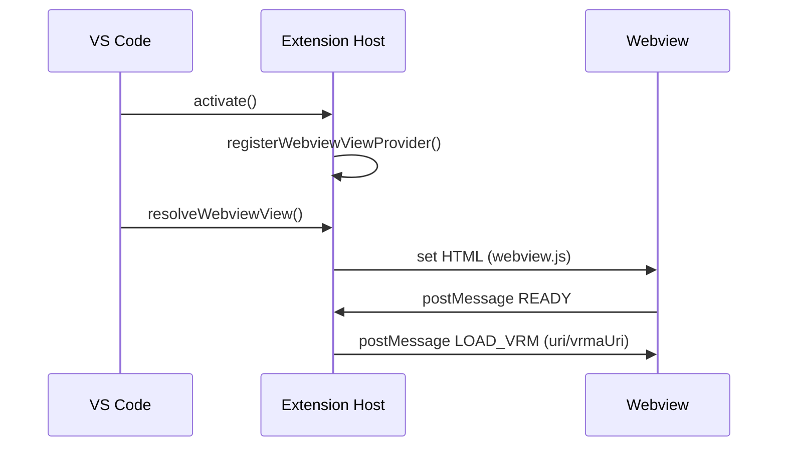
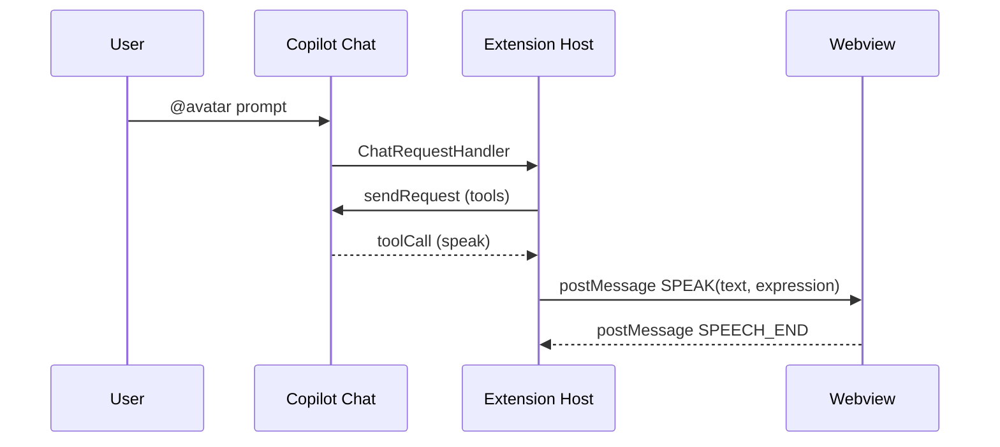
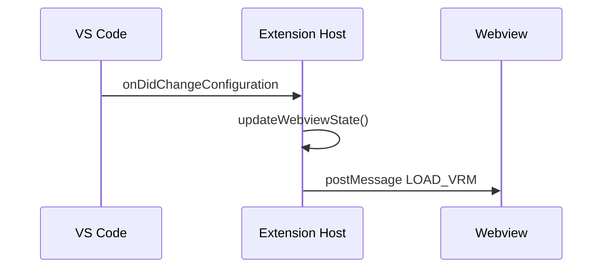

<!-- This document is generated and updated by .github/prompts/doc-sync.prompt.md -->

# Key Flows

## 1) Extension Activation and Webview Initialization

When VS Code activates the extension, it registers the Webview view and loads the React bundle.

Files:

- [src/extension/extension.ts](../../src/extension/extension.ts)
- [src/webview/index.tsx](../../src/webview/index.tsx)

## 2) Copilot Chat → Avatar Speech

The chat participant streams responses, uses tools, and dispatches avatar speech to the Webview.

Files:

- [src/extension/chat/participant.ts](../../src/extension/chat/participant.ts)
- [src/shared/types.ts](../../src/shared/types.ts)

## 3) Settings Change → Reload Avatar

VRM/VRMA or system prompt changes trigger a Webview update.

Files:

- [src/extension/extension.ts](../../src/extension/extension.ts)
